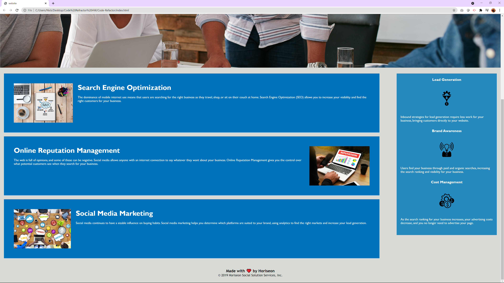

# Code-Refactor

In this code, I edited the index.html and the style.css code so that they are clearly defined and more accessable for future developers.

# The-Process

The first step I took in refactoring this code was looking at the index.html and style.css. While looking at those I made sure to identify which parts of the code corresponded to what so I would have a better understanding of each working part

From there, I started to identify parts of the code that seemed redundent and able to be consolidated. For example, the .benefit class was originally 3 different classes that all contained the same style changes. This code was able to be shortened down to .benefit, and the respective classes in the index.html file were changed to .benefit. All of the respective parts of the style.css that were consolidated then got the necessary changes in the index.html file.

Next, I went to the index.html to clean up any parts of the code that were not needed. There were some ID's that were coded in the index.html file that had no definition in the style.css file. Along side that were links that were not properly setup either.

Lastly, I went through the index.html file and changed the tags so that everything was accurately marked. The tags were needed to help recognize what parts of the code control the certain parts of the webpage.

# Useful Websites

While refactoring this code, I found the websites below useful for identifying the appropriate HTML tags to use.
    -MDN Web Docs (https://developer.mozilla.org/en-US/docs/Web/Guide/HTML/Using_HTML_sections_and_outlines)
    -W3schools (https://www.w3schools.com/tags/ref_byfunc.asp)

# Webpage link

Below is a link to the deployed website and imgages of the website running.

[Live-site](https://nickhyman465.github.io/Code-Refactor/)

